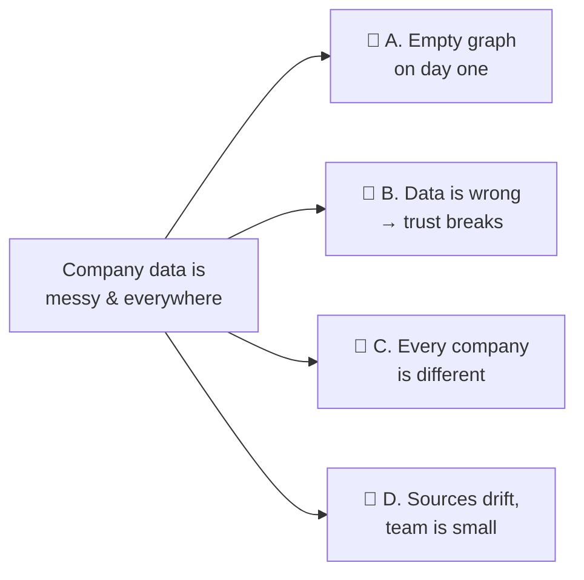
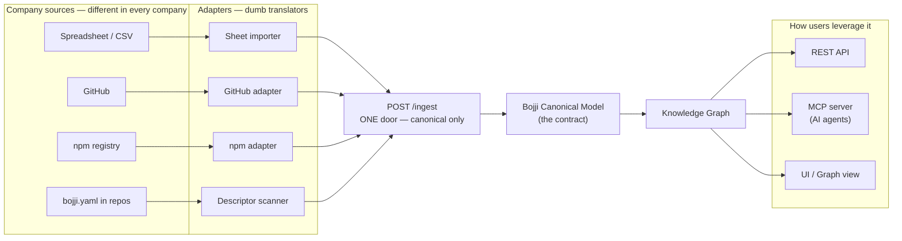
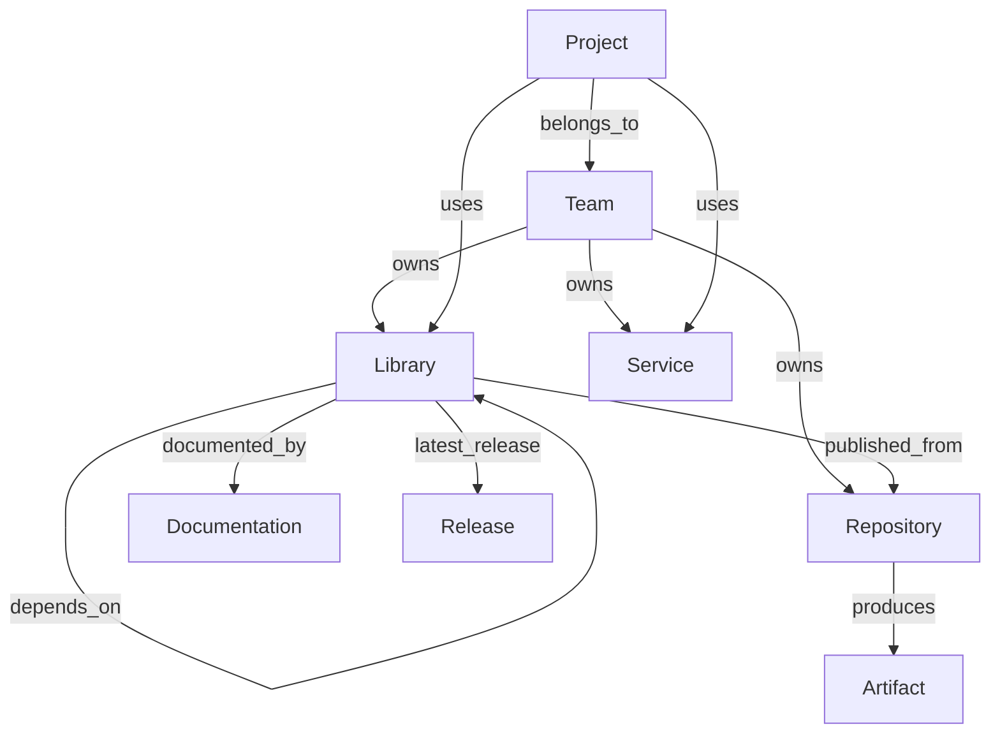
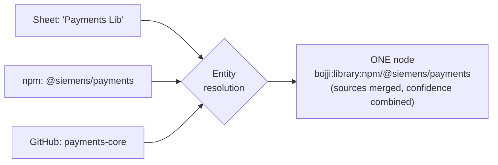
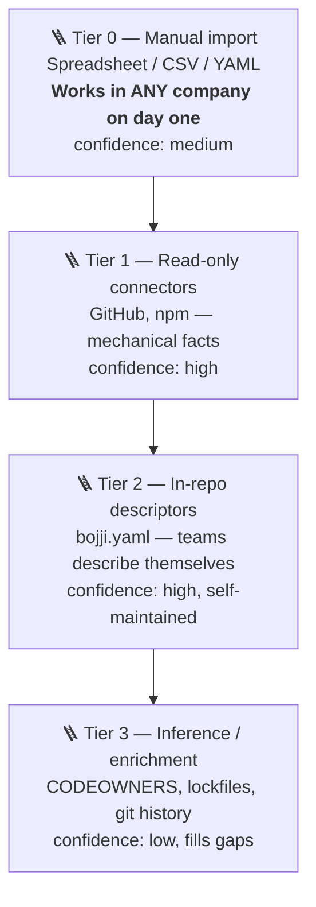
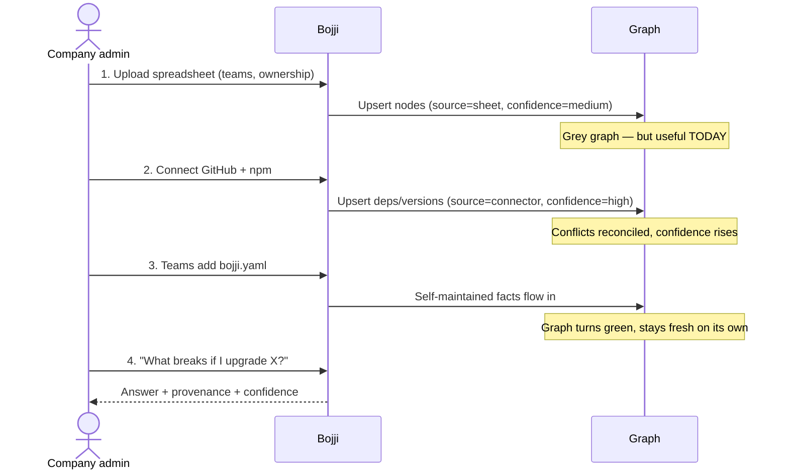
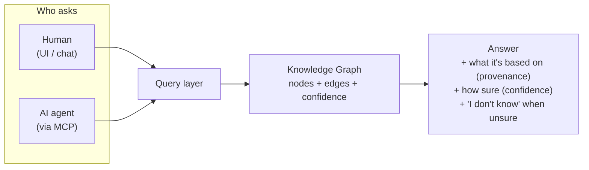

# Plan 001 — Data, Flow & Contracts

> **Focus of this plan:** how data gets *into* Bojji, how it flows through the system, the *contracts* that keep the product independent of any one company's data, and how a user (human or AI) turns that data into answers.
>
> **Out of scope (on purpose):** the wedge / first-user decision, pricing, and connector-by-connector detail. Those are separate plans.

---

## How to read this document

Every idea is tagged so you can always tell what we already agreed on from what is being newly proposed:

- ✅ **EXISTING** — already in the confirmed spec (`spec_v0.1.md`). Not up for debate here.
- 🆕 **NEW** — a proposal from our brainstorm. This is what you're being asked to react to.
- 🔧 **REFINEMENT** — an existing idea from the spec, adjusted by a new proposal.

Sections are split into **🔴 Problem** (what hurts, no solution yet) and **🟢 Solution** (what we propose to do about it). Don't mix them in your head — the problems stand on their own even if you reject a solution.

---

# Part 1 — 🔴 The Problems

These are the four data problems this plan must solve. Each is stated plainly, with no solution attached yet.

### Problem A — The empty graph (cold start)
A knowledge graph is worth **zero** when empty. On day one, in any company, there is nothing in it. If filling it requires every team to do work first, nobody starts, and the product dies before it's useful.

### Problem B — The data is never great at first, and trust is everything
Real company data is incomplete, contradictory, and out of date. A graph that is *60% correct* doesn't feel *60% useful* — it produces answers that are **confidently wrong**. One wrong answer during a real migration destroys trust permanently.

### Problem C — Bojji must work in many different companies
You want to run Bojji at Siemens today and somewhere else tomorrow. Every company stores its data differently (different tools, different formats, different conventions). If Bojji's core is wired to any one company's setup, it isn't portable.

### Problem D — One maintainer, many drifting sources
Each data source (GitHub, npm, Jira…) is a permanent liability that breaks when its API changes. A small team cannot babysit a dozen of them forever.



---

# Part 2 — 🟢 The Core Idea

### The one principle everything hangs on 🆕

> **Portability doesn't come from having good data. It comes from having a data *contract* that any company's data can be poured into.**

We define **one canonical model that Bojji owns**. Every data source — a spreadsheet, GitHub, npm, a person typing — is just an **adapter** that translates that source's messy reality into the canonical model. Bojji's core (graph, queries, impact analysis, AI) only ever speaks the canonical model. **It never knows GitHub exists.**

This single seam solves Problem C directly: a new company doesn't change Bojji — it just points adapters at the contract.



> **The seam is the product.** Everything left of `/ingest` is replaceable per company. Everything right of it is Bojji, and it's the same everywhere.

---

# Part 3 — 🟢 The Canonical Model (BCM)

### The entities and relationships ✅ EXISTING
These come straight from the confirmed spec. The model itself is *not* new — we're just naming it "the contract."



### What's NEW: every fact carries identity, source, and confidence 🆕
The spec describes *what* the entities are. It does **not** say how we know a fact is true or how fresh it is. We wrap every node and every edge with three things:

| Field | Plain meaning | Solves |
|---|---|---|
| **identity (URN)** | A stable, unique name for the thing, e.g. `bojji:library:npm/@siemens/payments` | Problem C (same thing across sources) |
| **provenance (source)** | Where this fact came from (which adapter, when) | Problem B (trust) |
| **confidence** | How sure we are (high for connectors, medium for a spreadsheet, low for a guess) | Problem B (trust) |
| **last_seen** | When we last confirmed it | Problem B (freshness) |

This is the single most important new idea in the plan. It turns *"our data isn't great initially"* from a **fatal flaw** into a **visible, improving metric** — the graph shows its own confidence and gets greener as sources agree.

### Stable identity (URN) — the hardest part 🆕
When the spreadsheet says "Payments Lib," npm says `@siemens/payments`, and GitHub says repo `payments-core` — are those the **same node**? We need a naming scheme and merge rules, or we get three ghost nodes and a graph nobody trusts.



---

# Part 4 — 🟢 How the graph gets filled: the Ingestion Ladder

### The four tiers 🆕
A company climbs this ladder over time. Bojji supports **all rungs at once** — the higher rungs just raise confidence on the *same* nodes.



**Why this ladder answers the problems:**

- **Tier 0 (spreadsheet) beats the empty graph (Problem A).** No connector to build, no OAuth, no admin approval. You can walk into any company and have a live graph in an hour. It's *also* the only source for facts that live in no system — ownership, "who really maintains this." Never treat it as a toy; it's the floor that guarantees Bojji always works somewhere.
- **Tier 2 (`bojji.yaml`) beats the maintenance burden (Problem D).** Ownership flips from *you* to *the teams*, and it's git-versioned so it rots slower than a wiki.

> **The key split:** the *spreadsheet* captures what **humans** know (ownership, org structure). *Connectors* capture what **machines** know (dependencies, versions). Different sources, different confidence, one model.

---

# Part 5 — 🟢 The one door: `POST /ingest`

### 🔧 REFINEMENT of the spec's Connector interface
The spec defined a `Connector` interface where each connector *pulls* (`syncTeams()`, `syncRepositories()`…). We keep that idea but flip the direction: **adapters translate, then *push* canonical entities to a single `/ingest` endpoint.** Every source — spreadsheet or connector — hits the same door. Adapters become dumb translators; the smart logic (identity, merge, confidence) lives in one place, not copied into every connector.

**A canonical entity going through the door looks like this** 🆕 (illustrative shape, not final):

```json
{
  "urn": "bojji:library:npm/@siemens/payments",
  "type": "Library",
  "attributes": { "name": "payments", "latestVersion": "3.2.1" },
  "relationships": [
    { "type": "owned_by", "target": "bojji:team/payments-team" },
    { "type": "depends_on", "target": "bojji:library:npm/axios" }
  ],
  "provenance": { "source": "github-adapter", "confidence": "high", "seenAt": "2026-07-16T12:00:00Z" }
}
```

The `/ingest` endpoint **upserts**: if the URN exists, it merges the new facts with the old ones and recomputes confidence; if not, it creates the node. This is where reconciliation (Problem B) happens.

---

# Part 6 — 🟢 The strategy: Seed, then Enrich

This is the story of how a company goes from nothing to trusting Bojji — and it's the demo.



The customer literally **watches their graph go from grey to green.** That progression is both the onboarding path and the retention hook.

---

# Part 7 — 🟢 How the user leverages Bojji

Data is only worth something at the moment someone gets an answer. Both humans and AI agents ask through the same layer, and every answer is honest about how sure it is.



**A concrete walkthrough — the moment of value:**

1. An engineer asks (in chat, or an AI agent asks via MCP): *"If I upgrade `@siemens/payments` to v4, what breaks?"*
2. Bojji walks the graph: who **depends_on** payments → which projects **use** those → which teams **own** them.
3. Bojji answers with the blast radius **and** its confidence: *"6 projects across 3 teams depend on it. High confidence for 5 (from lockfiles); 1 is medium (from the spreadsheet, unverified)."*
4. The honest **"1 is medium"** is the trust feature — it's the difference between a tool people rely on and one that quietly lies (Problem B).

The ✅ EXISTING REST endpoints (`GET /impact/{library}`, `/graph`, …) and ✅ EXISTING MCP tools (`impact_analysis()`, `find_dependents()`, …) are the surfaces for exactly this. 🆕 The NEW part is that every response also returns **provenance + confidence**.

---

# Part 8 — Summary: what's confirmed vs. what's new

| Area | Status | Note |
|---|---|---|
| Entity & relationship model | ✅ EXISTING | Straight from `spec_v0.1.md` |
| REST API + MCP server + tools | ✅ EXISTING | The query surfaces |
| Persisted vs. live data split | ✅ EXISTING | Still holds |
| Connectors (GitHub, npm, Jira, Confluence) | ✅ EXISTING | Still the targets |
| **Bojji Canonical Model as the explicit contract** | 🆕 NEW | The decoupling seam |
| **Identity (URN) + entity resolution / merge** | 🆕 NEW | Hardest, most important |
| **Provenance + confidence + last_seen on every fact** | 🆕 NEW | Turns bad data into a visible metric |
| **Ingestion ladder (Tier 0–3)** | 🆕 NEW | Beats cold start & maintenance |
| **Tier 0 spreadsheet / CSV / YAML importer** | 🆕 NEW | The universal adapter |
| **`bojji.yaml` in-repo descriptors** | 🆕 NEW | Shifts upkeep to teams |
| **Single `POST /ingest` upsert door** | 🔧 REFINEMENT | Connectors *push* canonical, not *pull* |
| **Seed-then-enrich onboarding** | 🆕 NEW | The demo & retention path |
| **Answers carry provenance + confidence** | 🆕 NEW | The trust feature |

---

# Part 9 — Open decisions (need your call)

These are the forks this plan surfaces but doesn't decide:

1. **Spreadsheet template: fixed or mapped?** Do we dictate the columns, or let each company map their columns to BCM fields? (Mapping = more work, far more portable.)
2. **URN scheme:** what's the exact identity format, and what are the merge rules when two sources describe the same thing differently?
3. **Confidence model:** simple 3-level (high/medium/low), or a numeric score? How do we combine confidence when sources agree vs. conflict?
4. **Storage:** does the provenance/confidence wrapper change the Neo4j-vs-Postgres decision from the spec? (Worth revisiting once this model is locked.)

---

# Next steps

- [ ] React to the 🆕 NEW proposals — accept, cut, or change.
- [ ] Decide the four open questions in Part 9.
- [ ] Then: write **Plan 002 — the concrete BCM schema + spreadsheet template + `/ingest` contract** (the first buildable artifact, true regardless of which wedge we pick).
